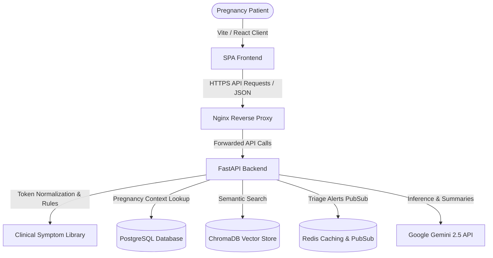

# MotherCare AI — System Architecture

This document describes the design, components, and data request flows for the MotherCare AI Clinically Guided Maternal Support System.

---

## 🏛️ System Topology

---

## ⚙️ Core Architecture Layers

### 1. Stateful Clinical Interview Engine
When a patient inputs a query, the request flows as follows:
1. **Multilingual Token Intersection Normalizer**: Normalizes Tamil, Tanglish, and English strings (e.g., mapping `"moothiram erichal"` to burning urination).
2. **Branching Question Stack Evaluator**:
   - Compares query with `CLINICAL_EMERGENCY_RULES` first to trigger immediate emergency overrides.
   - If not a critical emergency, checks for missing data. If the patient's gestational week is not recorded in the DB, it prepends the `"How many weeks pregnant are you?"` question to the interview flow.
   - Dynamically injects clinical checkups (such as BP, blur, and swelling for headache symptoms).
3. **Session Cache**: Automatically records active answers and detects clinical contradictions in real-time (e.g., if a user reports vaginal bleeding but then denies any red discharge).

### 2. Hybrid Risk & Triage Engine
Determines patient risk levels on a 4-tier model:
- **Emergency (Red) 🔴**: Triggers for any life-threatening symptoms (e.g., heavy bleeding, severe one-sided pain).
- **High Risk (Orange) 🟠**: E.g., blood pressure >= 140/90, or high risk ML model outputs.
- **Moderate Risk (Yellow) 🟡**: Persistent symptoms requiring standard clinical checkups.
- **Routine / Home Care (Green) 🟢**: Safe to monitor at home with supportive guidelines.

When a risk trigger occurs, the backend calls the `create_maternal_alert` handler, which writes to the PostgreSQL DB and publishes an alert to the Redis event broker. Connected doctors receive push alerts instantly via WebSockets.

### 3. Retrieval-Augmented Generation (RAG)
For non-emergency consults, local hospital guidelines are retrieved from ChromaDB:
- Uploaded PDFs are parsed into text chunks, embedded, and indexed.
- FastAPI performs cosine similarity matching.
- **Robust Exception Fallback**: If ChromaDB or Gemini API fails, the backend intercepts the error and returns a safe, deterministic clinical dictionary guideline instead of throwing an exception or returning generic fallbacks.

---

## 🛡️ Security Hardening

- **JWT Auth & RBAC**: Strict role boundaries for Patients, Doctors, and Admins.
- **File Upload Security**: Max 5 MB, extensions restricted to image types, and signature checking to prevent arbitrary code execution or directory traversal.
- **Transaction Consistency**: SqlAlchemy context managers rollback DB updates on execution failures.
- **Audit Trails**: All doctor override comments and risk status transitions are logged to the `AuditTrail` table.
